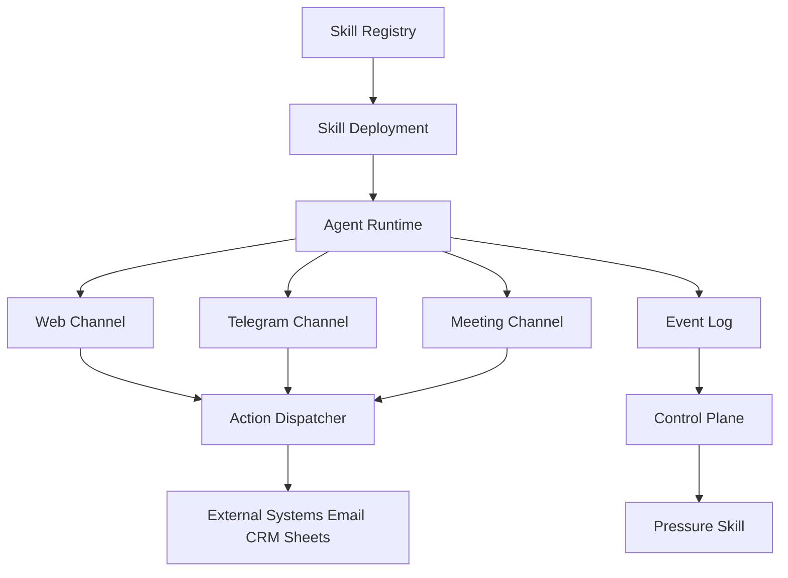

# AXIMO WORKS — SYSTEM_MAP_v1

## 1. Purpose

This document defines the high-level structural map of Aximo Works.
It is the constitutional overview of the system.

Aximo Works is:

> A Skill-Based AI Workforce Runtime
> with a Founder-Controlled Execution Layer

This is NOT a chatbot product.
This is NOT a single automation tool.
This is a Skill Factory + Control Plane architecture.

---

# 2. Core System Structure

Aximo consists of four primary layers:

1. Skill Factory Layer
2. Runtime Execution Layer
3. Observability Layer
4. Founder Control Plane

---

# 3. Structural Diagram

---

# 4. Two Fundamental Loops

## 4.1 External Value Loop (Revenue Loop)

Purpose: Generate measurable business value.

Example flow:

1. Visitor interacts via Web Channel
2. LeadCaptureSkill executes
3. Action Dispatcher sends email / stores lead
4. Business receives opportunity

This loop generates revenue or cost savings.

---

## 4.2 Internal Control Loop (Stability Loop)

Purpose: Ensure reliability and governance.

1. All executions emit events
2. Events are stored in Event Log
3. Control Plane evaluates SLA / risk
4. Approval or Pressure Skills trigger if needed

This loop maintains trust, safety, and operational integrity.

---

# 5. Layer Definitions

## 5.1 Skill Factory Layer

Responsible for creating and managing reusable AI employee templates.

Components:

- Skill Registry (metadata + versioning)
- Skill Definition
- Deployment Manager
- Configuration Store

A Skill is an installable AI employee template.

Examples:
- LeadCaptureSkill
- MeetingAgentSkill
- DevPMSkill
- DocumentDraftSkill

---

## 5.2 Runtime Execution Layer

Responsible for real-time execution.

Execution skeleton:

Input → Preprocess → Context → Skill Logic → LLM → Postprocess → Action → Event

This layer is channel-agnostic.

---

## 5.3 Observability Layer

Responsible for traceability and audit.

- Event Log
- Metrics
- Error Tracking
- Execution History

All executions must emit structured events.

---

## 5.4 Founder Control Plane

Responsible for governance and oversight.

- Approval Gate
- Risk-Based Execution Rules
- SLA Monitoring
- Escalation
- Pressure Skill

The Control Plane does not replace execution.
It supervises execution.

---

# 6. Design Principles

1. All functionality is implemented as Skills.
2. All Skills share a common runtime skeleton.
3. Every execution produces events.
4. Deployment is versioned.
5. Control Plane is logically separate from execution.
6. The system must support DFY deployment and future SaaS exposure.

---

# 7. What This Document Does NOT Define

- Risk model details
- Approval thresholds
- Skill state transitions
- Multi-tenant isolation strategy
- Version migration strategy

Those are defined in subsequent documents.

---

# 8. Status

Version: v1
Scope: Structural Map Only

This document defines the architectural backbone.
All subsequent specifications must conform to this structu